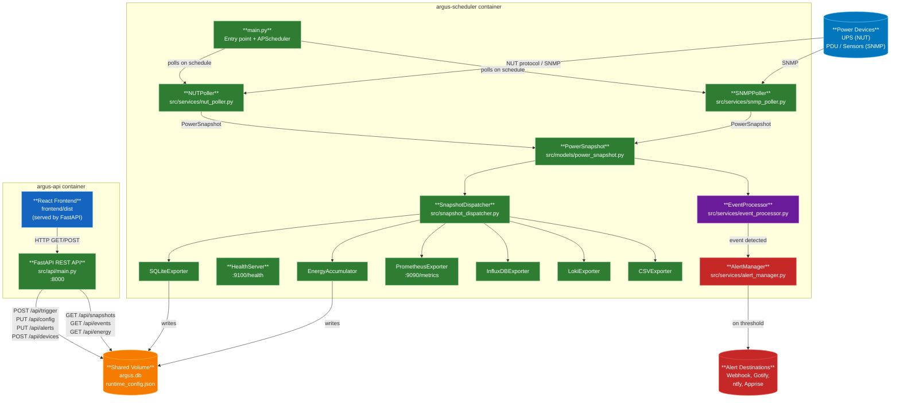
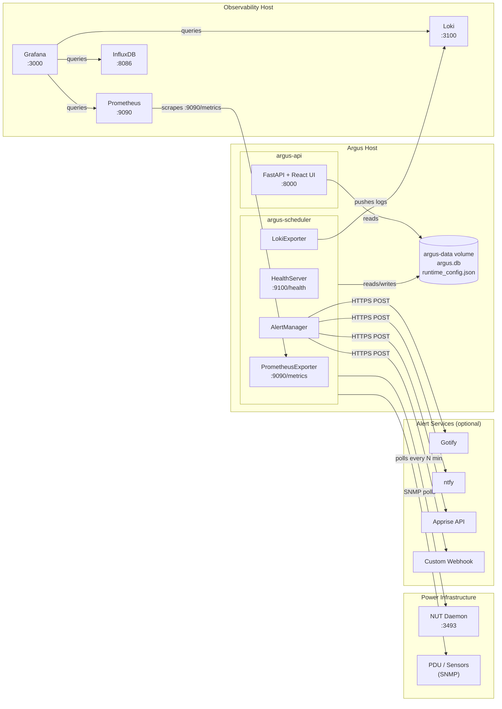

# 🏗️ Architecture Overview

Argus is designed as a two-container system that continuously monitors power infrastructure via NUT
and SNMP, exports telemetry to multiple observability destinations, and serves a React frontend
through a FastAPI backend.

---

## 🏗️ System Architecture

### Data Flow

### 🌐 Deployment Topology

---

## 🔧 Component Reference

### argus-scheduler

The long-running background process responsible for all data collection.

| Component | Path | Responsibility |
| --- | --- | --- |
| `main.py` | `src/main.py` | Entry point, APScheduler setup, signal handling |
| `NUTPoller` | `src/services/nut_poller.py` | Queries NUT daemon via `PyNUTClient` |
| `SNMPPoller` | `src/services/snmp_poller.py` | Queries SNMP devices via PySNMP |
| `SnapshotDispatcher` | `src/snapshot_dispatcher.py` | Fans out `PowerSnapshot` to all enabled exporters |
| `EventProcessor` | `src/services/event_processor.py` | Detects state transitions; emits `PowerEvent` records |
| `AlertManager` | `src/services/alert_manager.py` | Fires notifications when event conditions are met |
| `DeviceRegistry` | `src/services/device_registry.py` | Persistent device catalogue (JSON-backed) |
| `HealthServer` | `src/services/health_server.py` | Lightweight HTTP health endpoint on `HEALTH_PORT` |

### argus-api

The HTTP server that serves both the REST API and the React SPA.

| Component | Path | Responsibility |
| --- | --- | --- |
| `main.py` | `src/api/main.py` | FastAPI app factory, middleware, static file serving |
| `auth.py` | `src/api/auth.py` | API key validation, rate limiting |
| `routes/snapshots` | `src/api/routes/snapshots.py` | Paginated power snapshot history |
| `routes/events` | `src/api/routes/events.py` | Paginated power event history |
| `routes/devices` | `src/api/routes/devices.py` | Device registry CRUD |
| `routes/alerts` | `src/api/routes/alerts.py` | Alert provider configuration |
| `routes/config` | `src/api/routes/config.py` | Runtime scheduler configuration |
| `routes/energy` | `src/api/routes/energy.py` | Cumulative kWh totals |
| `routes/trigger` | `src/api/routes/trigger.py` | Manual poll trigger |
| `routes/diagnostics` | `src/api/routes/diagnostics.py` | Last-poll diagnostics |

---

## 📤 Exporters

| Exporter | Key | Description |
| --- | --- | --- |
| `SQLiteExporter` | `sqlite` | Writes snapshots to `argus.db`; enforces retention |
| `PrometheusExporter` | `prometheus` | Exposes Gauge metrics at `/metrics` |
| `InfluxDBExporter` | `influxdb` | Writes points to InfluxDB v2 |
| `LokiExporter` | `loki` | Pushes structured log lines to Loki |
| `CSVExporter` | `csv` | Appends rows to a rotating CSV file |
| `EnergyAccumulatorExporter` | `energy` | Accumulates kWh from watt-second snapshots |

Enable exporters via `ENABLED_EXPORTERS=sqlite,prometheus,influxdb` (comma-separated).

---

## ⚙️ Runtime Configuration

Both containers share the `argus-data` volume. The scheduler watches
`data/runtime_config.json` for changes written by the API, enabling zero-restart
reconfiguration of:

- Poll interval
- Enabled exporters
- NUT connection settings
- Alert provider configuration
- Scheduler pause / resume

---

## 📊 Grafana Dashboard

**Import pre-built dashboard:**

1. Download `docs/grafana-dashboard.json`
2. In Grafana: **+ → Import → Upload JSON file**
3. Select Prometheus as the datasource
4. Dashboard includes:

   - Per-device power draw and load percentage charts
   - Battery charge and runtime remaining panels
   - UPS status and event timeline
   - Input/output voltage and temperature gauges

---

## 🌐 Ports Summary

| Container | Port | Protocol | Purpose |
| --- | --- | --- | --- |
| `argus-api` | `8000` | HTTP | REST API + React UI |
| `argus-scheduler` | `9090` | HTTP | Prometheus `/metrics` (when enabled) |
| `argus-scheduler` | `9100` | HTTP | Health check `/health` |
