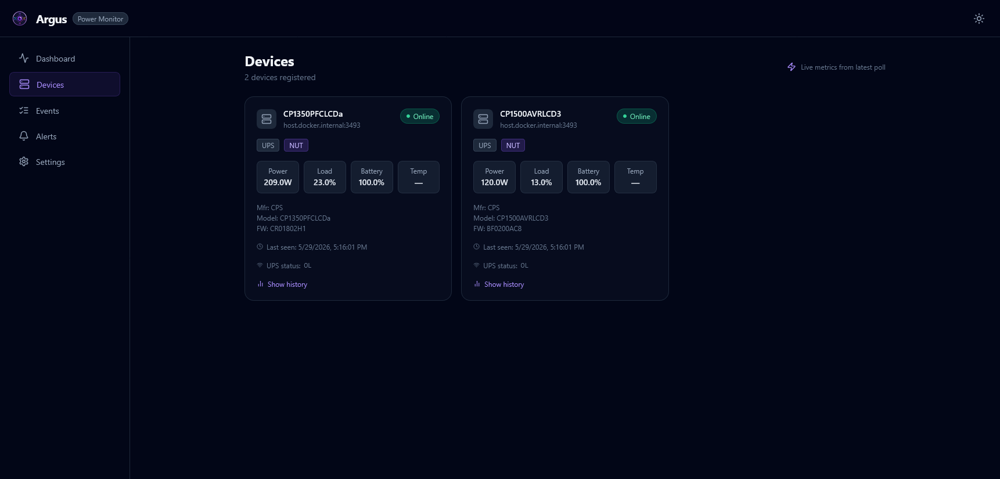
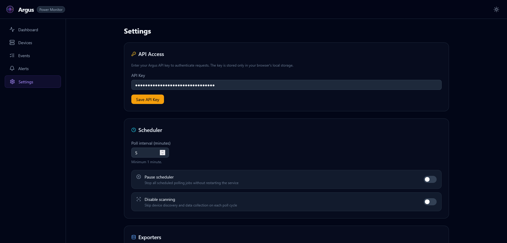

# 🚀 Getting Started

This guide covers deployment, configuration, and first steps with Argus.

---

## 🐳 Quick Start with Docker Compose

The fastest way to get Argus running:

```bash
# Create docker-compose.yml
curl -o docker-compose.yml \
  https://raw.githubusercontent.com/fabell4/argus/main/docker-compose.yml

# Create .env file
curl -o .env \
  https://raw.githubusercontent.com/fabell4/argus/main/.env.example

# Edit NUT_HOST to point at your NUT daemon (see note below)
# Start containers
docker compose up -d

# Access the UI
open http://localhost:8000
```

> **Docker networking note:** `NUT_HOST=localhost` refers to the Argus container itself,
> not your host machine. Use your host's LAN IP, `host.docker.internal` (macOS/Windows),
> or the Docker service name if NUT runs in the same compose stack.



---

## 🐳 Self-Hosting Guide

Argus runs as two containers from the same Docker image:

- **argus-scheduler** — Background worker that polls devices and dispatches telemetry
- **argus-api** — FastAPI REST API serving the React frontend

### Minimal docker-compose.yml

```yaml
services:
  argus-scheduler:
    image: registry.greenflametech.net/argus:latest
    container_name: argus-scheduler
    restart: unless-stopped
    command: python -m src.main
    volumes:
      - argus-data:/app/data
      - argus-logs:/app/logs
    extra_hosts:
      - "host.docker.internal:host-gateway"   # Linux: reach host NUT daemon
    environment:
      NUT_HOST: "host.docker.internal"         # adjust to your NUT address
      NUT_AUTO_DISCOVER: "true"
      POLL_INTERVAL_MINUTES: "5"
      ENABLED_EXPORTERS: "sqlite,prometheus"
      PROMETHEUS_PORT: "9090"
    env_file:
      - path: .env
        required: false

  argus-api:
    image: registry.greenflametech.net/argus:latest
    container_name: argus-api
    restart: unless-stopped
    command: uvicorn src.api.main:app --host 0.0.0.0 --port 8000
    ports:
      - "8000:8000"
    volumes:
      - argus-data:/app/data
    depends_on:
      - argus-scheduler
    env_file:
      - path: .env
        required: false

volumes:
  argus-data:
  argus-logs:
```

---

## ⚙️ Environment Variables

Copy `.env.example` to `.env` and adjust as needed.

### Application

| Variable | Default | Description |
| --- | --- | --- |
| `APP_ENV` | `production` | Runtime environment (`production` / `development`) |
| `LOG_LEVEL` | `INFO` | Log verbosity (`DEBUG` / `INFO` / `WARNING` / `ERROR`) |
| `TZ` | `UTC` | IANA timezone (e.g. `America/New_York`) |

### Polling

| Variable | Default | Description |
| --- | --- | --- |
| `POLL_INTERVAL_MINUTES` | `5` | How often to poll all devices |
| `POLL_ON_STARTUP` | `true` | Run an immediate poll when the scheduler starts |

### 🔌 NUT (Network UPS Tools)

| Variable | Default | Description |
| --- | --- | --- |
| `NUT_HOST` | `localhost` | Hostname or IP of the NUT daemon |
| `NUT_PORT` | `3493` | NUT TCP port |
| `NUT_USERNAME` | _(empty)_ | NUT authentication username |
| `NUT_PASSWORD` | _(empty)_ | NUT authentication password |
| `NUT_UPS_NAME` | `ups` | UPS device name (ignored when `NUT_AUTO_DISCOVER=true`) |
| `NUT_AUTO_DISCOVER` | `true` | Auto-discover all UPS units from the NUT daemon |

### 📡 SNMP

| Variable | Default | Description |
| --- | --- | --- |
| `SNMP_COMMUNITY` | `public` | SNMPv1/v2c community string |
| `SNMP_VERSION` | `2c` | SNMP version (`1` / `2c` / `3`) |
| `SNMP_TIMEOUT` | `5` | Per-request timeout in seconds |
| `SNMP_RETRIES` | `2` | Retry count per request |
| `SNMP_V3_USERNAME` | _(empty)_ | SNMPv3 username (leave blank for v1/v2c) |
| `SNMP_V3_AUTH_PROTOCOL` | `MD5` | SNMPv3 auth protocol (`MD5` / `SHA`) |
| `SNMP_V3_AUTH_KEY` | _(empty)_ | SNMPv3 authentication key |
| `SNMP_V3_PRIV_PROTOCOL` | `DES` | SNMPv3 privacy protocol (`DES` / `AES`) |
| `SNMP_V3_PRIV_KEY` | _(empty)_ | SNMPv3 privacy key |

### 📤 Exporters

| Variable | Default | Description |
| --- | --- | --- |
| `ENABLED_EXPORTERS` | `sqlite` | Comma-separated list: `sqlite`, `prometheus`, `influxdb`, `loki`, `csv`, `energy` |
| `SQLITE_PATH` | `data/argus.db` | SQLite database path |
| `SQLITE_RETENTION_DAYS` | `90` | Delete snapshots older than this many days |
| `SQLITE_MAX_ROWS` | `100000` | Hard cap on snapshot rows |
| `PROMETHEUS_PORT` | `9090` | Prometheus metrics port (scheduler container) |
| `PROMETHEUS_DISABLE_LABELS` | `false` | Reduce cardinality by omitting device labels |
| `INFLUXDB_URL` | _(empty)_ | InfluxDB v2 URL (e.g. `http://influxdb:8086`) |
| `INFLUXDB_TOKEN` | _(empty)_ | InfluxDB API token |
| `INFLUXDB_ORG` | _(empty)_ | InfluxDB organisation |
| `INFLUXDB_BUCKET` | `argus` | InfluxDB bucket name |
| `LOKI_URL` | _(empty)_ | Loki push API URL (e.g. `http://loki:3100`) |
| `LOKI_JOB_LABEL` | `argus_power` | Loki job label |
| `CSV_PATH` | `data/argus.csv` | CSV output path |
| `CSV_MAX_SIZE_MB` | `10` | Roll CSV file when it exceeds this size |
| `CSV_RETENTION_DAYS` | `30` | Remove CSV rows older than this many days |
| `ENERGY_RATE_PER_KWH` | `0` | Cost per kWh for energy cost calculations (0 = disabled) |

### ⚡ Event Thresholds

| Variable | Default | Description |
| --- | --- | --- |
| `DEVICE_OFFLINE_MISSED_POLLS` | `3` | Missed polls before a `device_offline` event fires |
| `SHUTDOWN_BATTERY_FLOOR_PCT` | `5` | Battery % that triggers `shutdown_initiated` |
| `THRESHOLD_LOAD_PERCENT` | `90` | Load % that triggers a `threshold_crossed` event |
| `THRESHOLD_TEMP_CELSIUS` | `50` | Temperature (°C) that triggers a `threshold_crossed` event |

### API

| Variable | Default | Description |
| --- | --- | --- |
| `API_HOST` | `0.0.0.0` | Bind address for the API server |
| `API_PORT` | `8000` | API server port |
| `API_KEY` | _(empty)_ | Secret API key — minimum 32 characters; leave blank to disable auth |
| `ALLOWED_ORIGINS` | `http://localhost:3000,http://localhost:5173` | CORS allowed origins |
| `RATE_LIMIT_PER_MINUTE` | `60` | Max requests per 60-second window per API key |

### 🩺 Health Server

| Variable | Default | Description |
| --- | --- | --- |
| `HEALTH_PORT` | `9100` | Scheduler health-check HTTP port |

### 🔔 Alerting

| Variable | Default | Description |
| --- | --- | --- |
| `ALERT_FAILURE_THRESHOLD` | `3` | Consecutive failures before alerting |
| `ALERT_COOLDOWN_SECONDS` | `3600` | Minimum seconds between repeated alerts |
| `ALERT_ON_BATTERY` | `true` | Alert when UPS switches to battery |
| `ALERT_ON_BATTERY_LOW` | `true` | Alert on low battery condition |
| `ALERT_ON_DEVICE_OFFLINE` | `true` | Alert when a device goes offline |
| `ALERT_RECOVERY_NOTIFICATIONS` | `true` | Send recovery notifications when conditions clear |
| `WEBHOOK_URL` | _(empty)_ | Generic webhook URL (must be HTTPS) |
| `GOTIFY_URL` | _(empty)_ | Gotify server URL |
| `GOTIFY_TOKEN` | _(empty)_ | Gotify application token |
| `GOTIFY_PRIORITY` | `0` | Gotify message priority |
| `NTFY_URL` | _(empty)_ | ntfy server URL |
| `NTFY_TOPIC` | _(empty)_ | ntfy topic |
| `NTFY_TOKEN` | _(empty)_ | ntfy authentication token |
| `NTFY_PRIORITY` | _(empty)_ | ntfy message priority |
| `NTFY_TAGS` | _(empty)_ | Comma-separated ntfy tags |
| `APPRISE_URL` | _(empty)_ | Apprise API URL |



---

## 🔌 NUT Prerequisites

Argus connects to an existing NUT daemon — it does not ship NUT itself.

### 📦 Installing NUT

**Debian/Ubuntu:**

```bash
sudo apt install nut nut-client
```

**Home Assistant OS:** Install the **Network UPS Tools** add-on from the add-on store.

**Docker (community image):**

```yaml
services:
  nut-upsd:
    image: instantlinux/nut-upsd:latest
    devices:
      - "/dev/bus/usb:/dev/bus/usb"
    environment:
      API_USER: monuser
      API_PASSWORD: secret
    ports:
      - "3493:3493"
```

### ✅ Verifying NUT Connectivity

```bash
# List all UPS units on the NUT daemon
upsc -l <nut-host>

# Query a specific UPS
upsc ups@<nut-host>
```

---

## 🛠️ Local Development

### Backend

```bash
python -m venv .venv
.venv\Scripts\activate        # Windows
# source .venv/bin/activate   # Linux/macOS
pip install -r requirements-dev.txt

# Scheduler process
python -m src.main

# API process (separate terminal)
uvicorn src.api.main:app --reload --port 8000
```

### Frontend

```bash
cd frontend
npm ci
npm run dev   # Vite dev server proxies /api/* to http://localhost:8000
```

---

## 🧪 Running Tests

### Python

```bash
pytest --cov=src --cov-report=term-missing -q
```

### Frontend

```bash
cd frontend
npm run test:coverage
```
