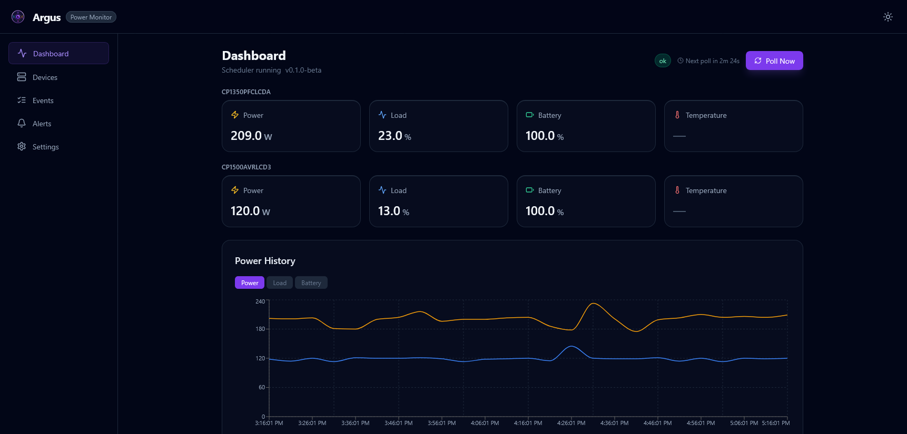

**Argus** is a self-hosted power monitoring platform for UPS devices (via NUT), PDUs, and sensors
(via SNMP). It periodically polls your power infrastructure, exports telemetry to multiple
destinations, fires structured events on state transitions, and sends alert notifications through
your preferred channels.



---

## ✨ Features

### 🚀 Core Capabilities

- **Multi-Device Polling** — NUT (UPS/battery) and SNMP (PDU/sensor) with configurable intervals
- **Automatic Discovery** — Auto-discovers all UPS units from a NUT daemon
- **Multi-Destination Export** — SQLite, Prometheus, InfluxDB, Loki, CSV, Energy accumulator
- **Modern Web UI** — React + Vite frontend with real-time charts and device dashboards
- **REST API** — Full-featured FastAPI backend for automation and integration
- **Alert Notifications** — Webhook, Gotify, ntfy, Apprise (100+ services)
- **Production-Ready** — Docker deployment, health checks, data retention policies

### 📊 Data Collection

Each poll cycle captures per-device:

- Power draw (watts)
- Load percentage
- Input/output voltage
- Battery charge percentage
- Estimated runtime remaining (seconds)
- UPS status flags (`OL`, `OB`, `LB`, `CHRG`, …)
- Temperature (°C, where available)

### 🔔 Event System

Argus detects and records state transitions as structured events:

| Event | Description |
| --- | --- |
| `on_battery` | UPS switched to battery power |
| `power_restored` | AC power returned |
| `battery_low` | Battery charge below low threshold |
| `shutdown_initiated` | Battery floor reached — graceful shutdown triggered |
| `threshold_crossed` | Load % or temperature exceeded configured limit |
| `device_offline` | Device missed consecutive poll attempts |
| `device_online` | Device reachable again after offline period |

### 🚨 Alert System

Send notifications on critical power events:

- Configurable failure threshold and cooldown
- Per-severity routing (`low` / `medium` / `high` / `critical`)
- Recovery notifications when conditions clear
- Multiple provider support (Webhook, Gotify, ntfy, Apprise)
- Test notifications before deploying

### 🔒 Security

- API key authentication with timing-attack prevention
- Per-key rate limiting with sliding windows
- SSRF protection on alert URLs (HTTPS-only)
- Request size limits
- Security headers (X-Frame-Options, CSP, etc.)
- Input validation on all endpoints

---

## 🚀 Quick Start

```bash
# 1. Pull the compose file
curl -o docker-compose.yml \
  https://raw.githubusercontent.com/fabell4/argus/main/docker-compose.yml

# 2. Create your .env
curl -o .env \
  https://raw.githubusercontent.com/fabell4/argus/main/.env.example

# 3. Edit .env — set NUT_HOST to your NUT daemon address
# 4. Start
docker compose up -d

# 5. Access the UI
open http://localhost:8000
```

---

## 📚 Documentation

- [Getting Started](getting-started) — Docker deployment, configuration, first steps
- [Architecture](architecture) — System design, data flow, deployment topology
- [API Reference](api-reference) — Complete REST API documentation
- [Alerts](alerts) — Notification provider setup guides
- [Security Guide](security) — Authentication, rate limiting, hardening
- [Runbook](runbook) — Operational guidance, log patterns, troubleshooting
