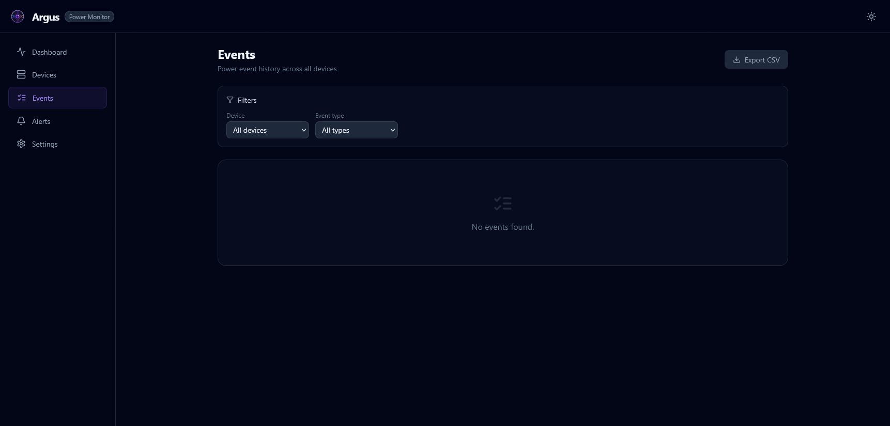

Operational guide for diagnosing and resolving production issues using logs and metrics.

## Table of Contents

- [Log Interpretation](#-log-interpretation)
- [Metric Thresholds](#-metric-thresholds)
- [Alert Investigation](#-alert-investigation)
- [Event Investigation](#-event-investigation)
- [SQLite Health](#-sqlite-health)
- [Common Failure Scenarios](#-common-failure-scenarios)
- [Escalation](#-escalation)

---

## 📋 Log Interpretation

Argus uses structured log lines at `INFO`, `WARNING`, and `ERROR` levels.

### 🔍 Key Log Patterns

| Pattern | Level | Meaning |
| --- | --- | --- |
| `Poll complete: N devices, N snapshots` | INFO | Normal poll cycle finished |
| `NUT poll failed` | ERROR | Cannot reach NUT daemon |
| `SNMP poll failed` | ERROR | SNMP device unreachable or timeout |
| `Exporter 'X' failed` | WARNING | Exporter skipped this cycle |
| `Alert sent successfully via X` | INFO | Alert provider delivered |
| `Alert provider 'X' failed` | ERROR | Provider could not send alert |
| `Runtime config saved` | INFO | UI-driven config change persisted |
| `EventProcessor: on_battery` | INFO | UPS switched to battery |
| `EventProcessor: power_restored` | INFO | AC power returned |
| `EventProcessor: device_offline` | WARNING | Device missed consecutive polls |
| `EventProcessor: battery_low` | WARNING | UPS battery critically low |
| `EventProcessor: shutdown_initiated` | CRITICAL | Battery floor reached — shutdown event fired |

### 📊 Log Levels Summary

- **INFO** — Normal operational events; no action required.
- **WARNING** — Degraded operation (e.g., exporter skipped, device briefly offline). Monitor for recurrence.
- **ERROR** — Failed operation; investigate root cause. App continues running.
- **CRITICAL** — Severe condition (e.g., battery floor reached, startup failure). Immediate attention required.

---

## 📊 Metric Thresholds

Prometheus metrics are exposed on `PROMETHEUS_PORT` (default `9090`). Suggested alert rules:

| Metric | Label | Warning | Critical |
| --- | --- | --- | --- |
| `argus_battery_percent` | `device_id` | < 50 % | < 20 % |
| `argus_load_percent` | `device_id` | > 70 % | > 90 % (`THRESHOLD_LOAD_PERCENT`) |
| `argus_runtime_seconds` | `device_id` | < 600 s | < 120 s |
| `argus_power_watts` | `device_id` | baseline ± 30 % | — |
| `argus_temperature_c` | `device_id` | > 40 °C | > 50 °C (`THRESHOLD_TEMP_CELSIUS`) |
| `argus_device_online` | `device_id` | — | = 0 (offline) |

> **Tip:** Set `PROMETHEUS_DISABLE_LABELS=true` to reduce label cardinality when monitoring many
> devices in a high-cardinality environment.

---

## 🔍 Alert Investigation

When an alert fires:

1. **Identify the event type** from the alert payload (`event_type` field).

2. **Check recent logs** for the triggering condition:

   ```bash
   docker logs argus-scheduler --tail 100 | grep -i "event\|battery\|offline"
   ```

3. **Query the events API** for the device's event history:

   ```bash
   curl "http://localhost:8000/api/events?device_id=ups-main&page_size=20"
   ```

4. **Check device status** via NUT directly:

   ```bash
   upsc ups@<nut-host>
   ```

5. **Trigger a manual poll** to get fresh telemetry:

   ```bash
   curl -X POST http://localhost:8000/api/trigger \
     -H "X-Api-Key: <key>"
   ```

6. **Confirm alert provider config** is enabled and URLs are correct:

   ```bash
   curl http://localhost:8000/api/alerts
   ```

---

## 🔍 Event Investigation



### `on_battery`

UPS switched from AC to battery power.

1. Check AC power status at the UPS location.
2. Verify `upsc ups@<host>` shows `ups.status: OB`.
3. Monitor `battery_percent` — if dropping, prepare for potential shutdown.
4. Expected recovery: `power_restored` event when AC returns.

### `battery_low`

Battery charge is below the NUT `battery.charge.low` threshold.

1. Verify load on the UPS — shed non-critical loads if possible.
2. Runtime is likely < 5–10 minutes. Initiate graceful shutdowns.
3. If `SHUTDOWN_BATTERY_FLOOR_PCT` is reached, a `shutdown_initiated` event fires.

### `device_offline`

Device missed `DEVICE_OFFLINE_MISSED_POLLS` consecutive polls.

1. Check network connectivity to the device host.
2. For NUT: verify `upsc -l <host>` responds.
3. For SNMP: `snmpwalk -v2c -c public <host>` to confirm reachability.
4. Check for NUT daemon restarts: `systemctl status nut-server`.
5. If using Docker: check `host.docker.internal` resolves correctly on Linux.

### `threshold_crossed`

Load % or temperature exceeded the configured limit.

1. For load: identify processes/devices consuming power — shed non-critical loads.
2. For temperature: check cooling/airflow around the device.
3. Review `THRESHOLD_LOAD_PERCENT` and `THRESHOLD_TEMP_CELSIUS` settings.

---

## 💾 SQLite Health

### Checking Database Size

```bash
du -sh data/argus.db
```

### Checking Row Count

```bash
sqlite3 data/argus.db "SELECT COUNT(*) FROM power_snapshots;"
```

### Manual Retention Cleanup

The SQLiteExporter runs retention automatically. To trigger manually:

```bash
sqlite3 data/argus.db \
  "DELETE FROM power_snapshots WHERE timestamp < datetime('now', '-90 days');"
sqlite3 data/argus.db "VACUUM;"
```

### WAL Mode

Argus uses WAL (Write-Ahead Logging) for SQLite to allow concurrent reads during writes.
WAL checkpoints happen automatically. If the WAL file grows unexpectedly large:

```bash
sqlite3 data/argus.db "PRAGMA wal_checkpoint(TRUNCATE);"
```

---

## 🚧 Common Failure Scenarios

### NUT Connection Refused in Docker

**Symptom:** `NUT poll failed: Connection refused` when `NUT_HOST=localhost`

**Cause:** `localhost` inside the container refers to the container, not the host.

**Fix:**

```bash
# Linux
NUT_HOST=host.docker.internal
# (ensure extra_hosts: host.docker.internal:host-gateway in docker-compose.yml)

# macOS/Windows
NUT_HOST=host.docker.internal

# Preferred: use host LAN IP
NUT_HOST=192.168.1.10
```

---

### Prometheus Metrics Not Appearing

**Symptom:** No data in Grafana / `curl http://localhost:9090/metrics` returns nothing

**Checks:**

1. Confirm `prometheus` is in `ENABLED_EXPORTERS`.
2. Verify `PROMETHEUS_PORT` matches the Prometheus scrape target.
3. Check scheduler logs: `Exporter 'prometheus' initialized`.

---

### Snapshots Not Written to SQLite

**Symptom:** `GET /api/snapshots` returns an empty list or 503

**Checks:**

1. Confirm `sqlite` is in `ENABLED_EXPORTERS`.
2. Verify the `argus-data` volume is mounted on both containers.
3. Check scheduler logs for `SQLiteExporter` errors.
4. Check disk space: `df -h`.

---

### Alert Not Delivered

**Symptom:** Event fired but no notification received

**Checks:**

1. Verify the provider is enabled in `GET /api/alerts`.
2. Confirm the provider URL is HTTPS and reachable from the container.
3. Check logs for `Alert provider 'X' failed` and the error message.
4. Use the test endpoint: `POST /api/alerts/test`.
5. Verify `ALERT_COOLDOWN_SECONDS` — the cooldown may be suppressing repeated alerts.

---

### Scheduler Container Exits Immediately

**Symptom:** `argus-scheduler` restarts in a loop

**Checks:**

1. View exit logs: `docker logs argus-scheduler --tail 50`.
2. Look for `CRITICAL` messages — usually a bad `API_KEY` length or missing required config.
3. Fix the environment variable and restart.

---

## 🆘 Escalation

If the runbook steps do not resolve the issue:

1. Collect full container logs: `docker logs argus-scheduler > scheduler.log 2>&1`
2. Export last-poll diagnostics: `curl http://localhost:8000/api/diagnostics`
3. Open an issue at [github.com/fabell4/argus](https://github.com/fabell4/argus) with logs attached.
